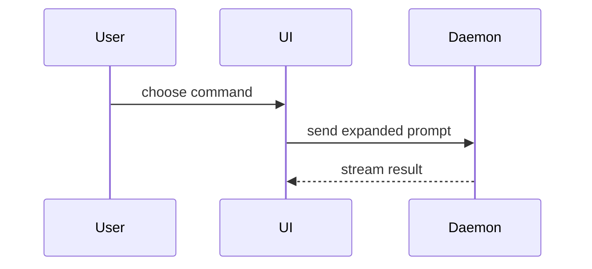

## Where Straddle skills use it

This section is Straddle's addition to the adapted text under "Views" below. It comes first because its limits apply to every view a Straddle skill shows. Straddle skills show the smallest view or views that explain each of these decision points:

| Skill and step | Point | Typical view |
| --- | --- | --- |
| Plan, [step 5](../../straddle-plan/steps/05-handoff.md) | The integration shape, and the files the plan changes | A Mermaid sequence of customer, Bridge and paykey, charge or payout, and the chosen notification path, and a `diff` file tree of the file-change table |
| Integrate, [step 4](../../straddle-integrate/steps/04-preview.md) | The Sandbox writes in the preview | A call tree or Mermaid chain of the preview rows by number: which returned ID feeds which row, and which account each row runs as |
| Test, [step 3](../../straddle-test/steps/03-preview.md) | Account A/B switching and the notification flow | A Mermaid sequence of the A and B requests, where the account header is sent or omitted, and how each outcome arrives through the webhook, FIFO, or polling endpoint |

- Show only what the plan, the preview, or the run already says. A visual never adds an operation, file, account, or decision.
- A visual never replaces safety text. The preview table and the approval question stay exactly as the step gives them, and the visual sits beside them. The developer approves the table, not the picture.
- Use IDs, external IDs, and row numbers. Never put a key, token, paykey value, or unmasked data in a visual.
- Keep a diagram to about eight nodes. Terminal clients show Mermaid as text, so a small one stays readable there.
- Show views inline. Only Plan's step 6 may write an HTML view, `straddle-plan-visual.html`. Integrate and Test write no visual files.
- Every HTML view, `straddle-plan-visual.html` included, follows [straddle-design.md](straddle-design.md) in light mode only: a near-white page with faintly warm paper surfaces, Terminal Green only for actions, status hues only beside status text, and every ID, row number, amount and timestamp in the mono data voice. Use its system font stack and tokens in one inline `<style>`. No gradients, emoji, glow, glass, or decorative icons or illustration, and no fonts, styles, scripts or images from the network. Check the page against that file's "Generated-design failures" before showing it.
- `straddle-plan-visual.html` has one fixed shape and nothing else: an `h1` that states the integration in one sentence, an ordered list of flow steps, and one status table. Each step gives its name, one short plain line, and the Straddle object it creates or uses, such as customer, paykey, charge, payout or webhook, in about 25 words or fewer. Steps sit in one row of equal-width columns on desktop, such as `grid-template-columns: repeat(N, minmax(0, 1fr))`, and stack in the same order on narrow screens. The flow has no code, routes, SDK method names, ID formats or idempotency rules; those stay in the plan. The status table has a header row and one row per step or planned item, with its state in words as the plan gives it. No header pills, subtitle, footnotes, extra cards, or metadata the flow or table already shows.
- Mermaid views use a plain light theme: Mermaid's default or `neutral` theme, with no `dark` or `forest` theme, no `classDef` or `style` colors, and no emoji in labels. An HTML view draws its diagram with HTML and CSS or inline SVG, never a Mermaid script.

## Views

Help the user understand the current topic of conversation visually. Skip the preamble and keep prose brief. Pick the smallest view that makes the key point clear.

- Show logic or an algorithm as pseudocode:

```text
on(save)
  if content is unchanged
    return cached result
  write new content
  return fresh result
```

- Show runtime control flow as a call tree:

```text
submitForm
  createSession
    persistPrompt
    launchAgent
  navigateToSession
```

- Show UI structure as a component tree, including state and module boundaries that matter:

```tsx
<SessionPage> (apps/example/src/routes/session.tsx)
  useSessionEvents()
  <SessionToolbar>
    <RunSkillButton> (packages/ui)
```

- Show file responsibility or a broad refactor as a shallow file tree:

```text
src/
├── commands/       # parses user actions
├── sessions/       # owns session state
└── transport/      # sends API requests
```

- Show component interaction, control flow, or data flow with Mermaid:



- Use `diff` when the point is what changes and the surrounding shape already exists. Match the diff shape to the topic.

For a component change:

```diff
 <SessionPage>
   useSessionEvents()
   <SessionToolbar>
+    <RunSkillButton />
   <SessionTimeline>
+    <SkillResultCard />
```

For a file-layout change:

```diff
 src/
 ├── commands/
+│   └── show-me.ts       # expands the slash command
 ├── sessions/
-└── transport.ts
+└── transport/
+    ├── client.ts
+    └── stream.ts
```

For a call-tree or call-stack change:

```diff
 submitForm
   createSession
     persistPrompt
+    expandSkillMention
     launchAgent
-  navigateToSession
+  navigateToSession
+    subscribeToEvents
```

For a state or control-flow change:

```diff
 on(save)
-  write content
+  if content is unchanged
+    return cached result
+  write new content
+  invalidate cache
```

- Show the whole block when most of it is new, when omitted context would hide ownership or order, or when the user needs a copyable target shape:

```ts
function expandSkill(command: string): string {
  const skillName = command.slice(1)
  return `use the ${skillName} skill`
}
```

- For a visual UI, layout, state comparison, or concept too dense for Mermaid, write one focused HTML file that fits the point. Match the product's colors, type, spacing, and components; use real labels and data; support desktop and mobile. Open it through the available browser or the operating system's supported file opener. If opening is unavailable, provide the file path and report that visual verification remains unperformed.

### guidance

Place each visual next to the short text it supports. Keep only the calls, files, props, states, and boundaries needed to answer the user's current question or the options to resolve the current discussion point.

You may use one of these, you may use several, it is unlikely you will use all of them. Use your judgement and don't overwhelm the user.

<!-- markdownlint-disable-file MD041 -->
